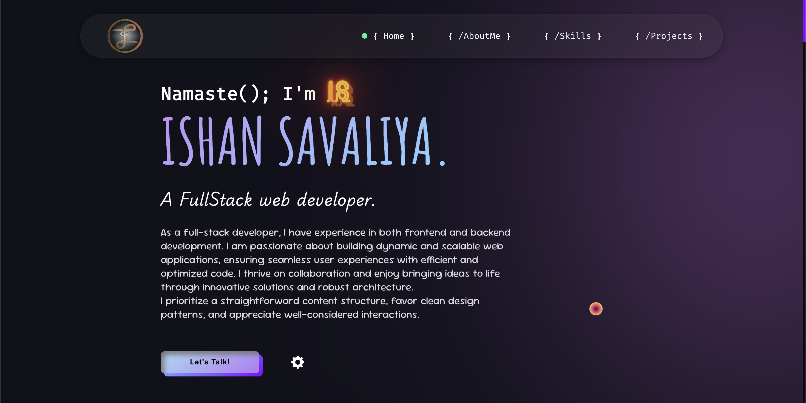

# 🚀 Ishan Savaliya Portfolio

Welcome to my **Personal Portfolio**! This project showcases my **skills, projects, and experience** as a **Full Stack Developer**.



---

## 🌟 Features

✅ **Modern & Responsive UI**  
✅ **Dark/Light Mode Toggle 🌙☀️**  
✅ **Interactive Animations 🎨**  
✅ **Fully Mobile Optimized 📱**  
✅ **SEO Friendly 🌍**

---

## 📂 Project Structure

    Ishan-Savaliya-Portfolio/
    │── index.html    # Main HTML file
    │── index.css     # Stylesheet
    │── main.js       # JavaScript functionality
    │── src/          # Images, fonts, and assets
    └── README.md     # Project documentation

---

## 🚀 Getting Started

### **🔧 Installation**

1. **Clone the repository:**
   ```sh
   git clone https://github.com/ishansavaliya/Ishan-Savaliya-Portfolio.git

Below is the final, error‐free version of your **README.md** file. You can simply copy and paste this into a file named **README.md** in your repository’s root folder and then commit and push it to GitHub.


2. **Navigate to the project directory:**
   ```sh
   cd Ishan-Savaliya-Portfolio
   ```
3. **Open `index.html` in your browser.**

---

## 🎨 How to Customize

- **Update Personal Info:** Edit the `index.html` file.
- **Change Styling:** Modify `index.css` to match your style.
- **Add New Projects:** Update the **Projects** section in `index.html`.

---

## 💡 How to Use

1. **Browse Sections:** Click on navbar links for smooth scrolling.
2. **Check Out My Skills:** View my **Tech Stack** in the Skills section.
3. **View My Projects:** Click on the **Projects** section to explore.
4. **Contact Me:** Use the **Let's Talk!** button to reach out.

---

## 📞 Connect With Me

💼 **LinkedIn:** [Ishan Savaliya](https://www.linkedin.com/in/iamishansavaliya/)

---

## 🤝 Contributions

Want to contribute? Follow these steps:

```sh
git clone https://github.com/ishansavaliya/Ishan-Savaliya-Portfolio.git
git checkout -b feature-branch
git commit -m "Added a new feature 🎨"
git push origin feature-branch
```

🙌 **Thank you for visiting my portfolio!**

